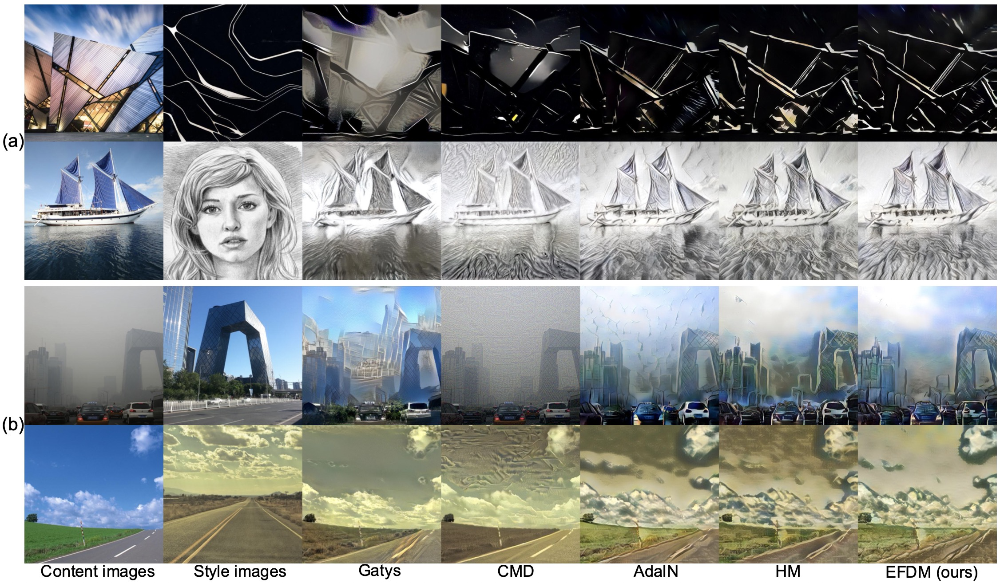

# pytorch-EFDM-AST


## Requirements
Please install requirements by `pip install -r requirements.txt`

- Python 3.5+
- PyTorch 0.4+
- TorchVision
- Pillow

(optional, for training)
- tqdm
- TensorboardX

## Usage

### Download Public Pre-trained VGG models
Download [vgg_normalized.pth](https://drive.google.com/file/d/1EpkBA2K2eYILDSyPTt0fztz59UjAIpZU/view?usp=sharing) and put it under `models/`.


### Train
Use `--content_dir` and `--style_dir` to provide the respective directory to the content and style images. 
Use `--style` to choose the module for style transfer, supporting [efdm, adain, adamean, adastd, hm] 
```
CUDA_VISIBLE_DEVICES=<gpu_id> python train.py --content_dir <content_dir> --style_dir <style_dir>  --style efdm
```
We also provide the decoder  pre-trained with `efdm` at [Google Drive](https://drive.google.com/file/d/18nJHi8vHVvyRnOGgbNqkWyc61NAhRCzV/view?usp=sharing) 
and [Baidu Drive](https://pan.baidu.com/s/1qHlMiFaIvieAWakh_PCeTQ?pwd=vayi) (Access code: vayi)

### Test
Use `--content` and `--style` to provide the respective path to the content and style image.
You should define the used `test_style_type`, which should be decided by the style_type of the used decoder. 
```
CUDA_VISIBLE_DEVICES=<gpu_id> python test.py --content input/content/cornell.jpg --style input/style/woman_with_hat_matisse.jpg --style_type efdm --test_style_type efdm --crop --decoder path_to_trained_decoder.pth.tar
```
You can also run the code on directories of content and style images using `--content_dir` and `--style_dir`. It will save every possible combination of content and styles to the output directory.
```
CUDA_VISIBLE_DEVICES=<gpu_id> python test.py --content_dir input/content --style_dir input/style --style_type efdm --test_style_type efdm --crop --decoder path_to_trained_decoder.pth.tar
```
For photo-realistic style transfer, `--photo` is added.
```
CUDA_VISIBLE_DEVICES=<gpu_id> python test.py --photo --content_dir input2/content --style_dir input2/style --style_type efdm --test_style_type efdm --crop --decoder path_to_trained_decoder.pth.tar
```

## References
- X. Huang and S. Belongie. "Arbitrary Style Transfer in Real-time with Adaptive Instance Normalization.", in ICCV, 2017.
- [PyTorch-AdaIN](https://github.com/naoto0804/pytorch-AdaIN)
