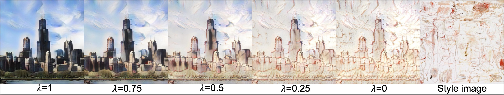

# EFDM in DG

This repo presents how to apply the EFDM in domain generalization tasks. Especially, we introduce a new EFDM variant, i.e., EFDMix.

#EFDM vs. EFDMix#
EFDM transforms the input to the target domain, while EFDMix transforms the input to the intermediate domain between input and target domains. 

|  |
|:-------------:|
| Fig.1: EFDM ($\lambda$=0) vs. EFDMix ($\lambda \in$ [0,1] )     |


Note that `EFDMix` has been included in [Dassl.pytorch](https://github.com/KaiyangZhou/Dassl.pytorch). See [the code](https://github.com/KaiyangZhou/Dassl.pytorch/blob/master/dassl/modeling/backbone/resnet.py#L439) for details.

EFDMix is very easy to implement. Below we show a brief implementation of it in PyTorch. The full code can be found [here](https://github.com/KaiyangZhou/Dassl.pytorch/blob/master/dassl/modeling/ops/efdmix.py).

```python
import random
import torch
import torch.nn as nn


class EFDMix(nn.Module):
    """EFDMix.

    Reference:
      Zhang et al. Exact Feature Distribution Matching for Arbitrary Style Transfer and Domain Generalization. CVPR 2022.
    """

    def __init__(self, p=0.5, alpha=0.1, eps=1e-6, mix="random"):
        """
        Args:
          p (float): probability of using MixStyle.
          alpha (float): parameter of the Beta distribution.
          eps (float): scaling parameter to avoid numerical issues.
          mix (str): how to mix.
        """
        super().__init__()
        self.p = p
        self.beta = torch.distributions.Beta(alpha, alpha)
        self.eps = eps
        self.alpha = alpha
        self.mix = mix
        self._activated = True

    def __repr__(self):
        return (
            f"MixStyle(p={self.p}, alpha={self.alpha}, eps={self.eps}, mix={self.mix})"
        )

    def set_activation_status(self, status=True):
        self._activated = status

    def update_mix_method(self, mix="random"):
        self.mix = mix

    def forward(self, x):
        if not self.training or not self._activated:
            return x

        if random.random() > self.p:
            return x

        B, C, W, H = x.size(0), x.size(1), x.size(2), x.size(3)
        x_view = x.view(B, C, -1)
        value_x, index_x = torch.sort(x_view)  # sort inputs
        lmda = self.beta.sample((B, 1, 1))
        lmda = lmda.to(x.device)

        if self.mix == "random":
            # random shuffle
            perm = torch.randperm(B)

        elif self.mix == "crossdomain":
            # split into two halves and swap the order
            perm = torch.arange(B - 1, -1, -1)  # inverse index
            perm_b, perm_a = perm.chunk(2)
            perm_b = perm_b[torch.randperm(perm_b.shape[0])]
            perm_a = perm_a[torch.randperm(perm_a.shape[0])]
            perm = torch.cat([perm_b, perm_a], 0)

        else:
            raise NotImplementedError

        inverse_index = index_x.argsort(-1)
        x_view_copy = value_x[perm].gather(-1, inverse_index)
        new_x = x_view + (x_view_copy - x_view.detach()) * (1-lmda)
        return new_x.view(B, C, W, H)

```

How to apply EFDMix to your CNN models? Say you are using ResNet as the CNN architecture, and want to apply EFDMix after the 1st and 2nd residual blocks, you can first instantiate the EFDMix module using
```python
self.efdmix = EFDMix(p=0.5, alpha=0.1)
```
during network construction (in `__init__()`), and then apply EFDMix in the forward pass like
```python
def forward(self, x):
    x = self.conv1(x) # 1st convolution layer
    x = self.res1(x) # 1st residual block
    x = self.efdmix(x)
    x = self.res2(x) # 2nd residual block
    x = self.efdmix(x)
    x = self.res3(x) # 3rd residual block
    x = self.res4(x) # 4th residual block
    ...
```

In our paper, we have demonstrated the effectiveness of EFDMix on two tasks: image classification and person re-identification. 
The source code for reproducing all experiments can be found in `./imcls` and `./reid`, respectively.

*Takeaways* on how to apply EFDMix to your tasks:
- Applying EFDMix typically results in better performance than MixStyle by characterizing high order statistics.
- Applying EFDMix to multiple lower layers is recommended (e.g., insert EFDMix after `res1` and `res2` in ResNets).
- Do not apply EFDMix to the last layer that is the closest to the prediction layer.
- Different tasks might favor different combinations.
- If you want to use the same configuration for all tasks/datasets for fair comparison, we suggest adding EFDMix to two consecutive layers, such as `res1` and `res2` in ResNets.

For more analytical studies, please read our paper at https://arxiv.org/abs/2203.07740.

## References
- Zhou, K., Yang, Y., Qiao, Y. and Xiang, T., 2021. Domain generalization with mixstyle, in ICLR, 2021.
- [MixStyle](https://github.com/KaiyangZhou/mixstyle-release)
